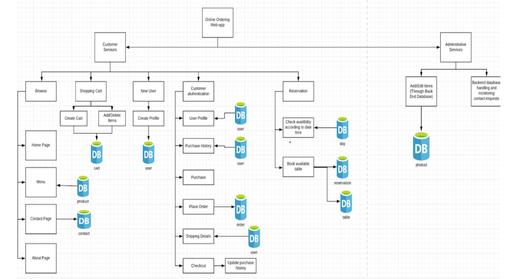

# KJSCE CANTEEN FOOD ORDERING SYSTEM 

 The KJSCE canteen online food ordering system is one of the latest services most of the computer students of our college are adopting. With this method, food from the KJSCE canteen is ordered online through our website and delivered to the customer( Student/proffessor) . This is made possible through the use of electronic payment systems. Customers pay with their credit cards, although credit card customers can be served even before they make payment  through cash . So, the system designed in this project will enable students/staff to go online and place orders for their food.

<h1> Block Diagram <h1>
   

### Built With

* [NodeJS](https://nodejs.org/en/)
* [ExpressJS](https://expressjs.com/en/starter/generator.html)
* [MongoDB](https://docs.mongodb.com/)
* [Handlebars](https://handlebarsjs.com/)
   
<h3>1. HomePage <h3>
   
   

<h3>2. Deal of the day <h3>
   
   
   
<h3>3. Signup <h3>
   
   
  
<h3>4. Sign-in <h3>
   
   
   
<h3>5. Cart and star rating <h3>
   
   
   
<h3>6. Checkout page <h3>
   
   
   
<h3>7. Payment with strip api <h3>
   
   
   
<h3>8. Confirmation email <h3>
   
   
   
  
<!-- CONTACT -->
## Contact the developers

Nandita  - nandita.kadam@somaiya.edu

Krisha - krisha.panchamia@somaiya.edu

